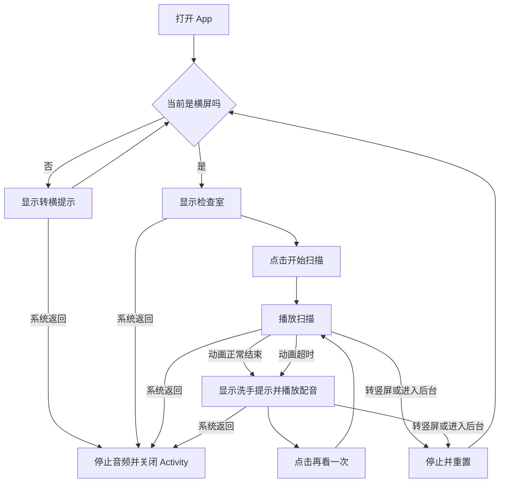
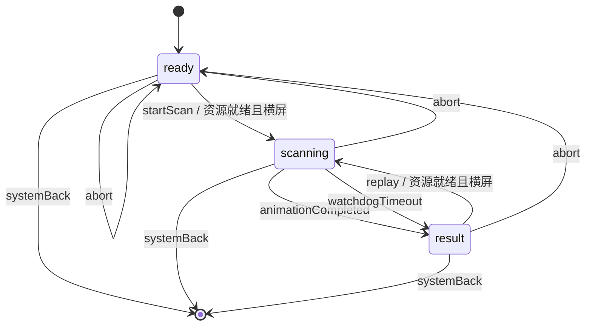
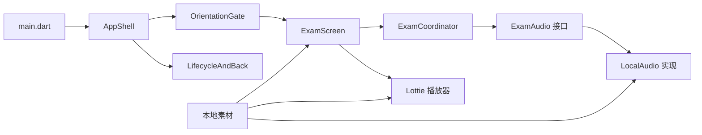
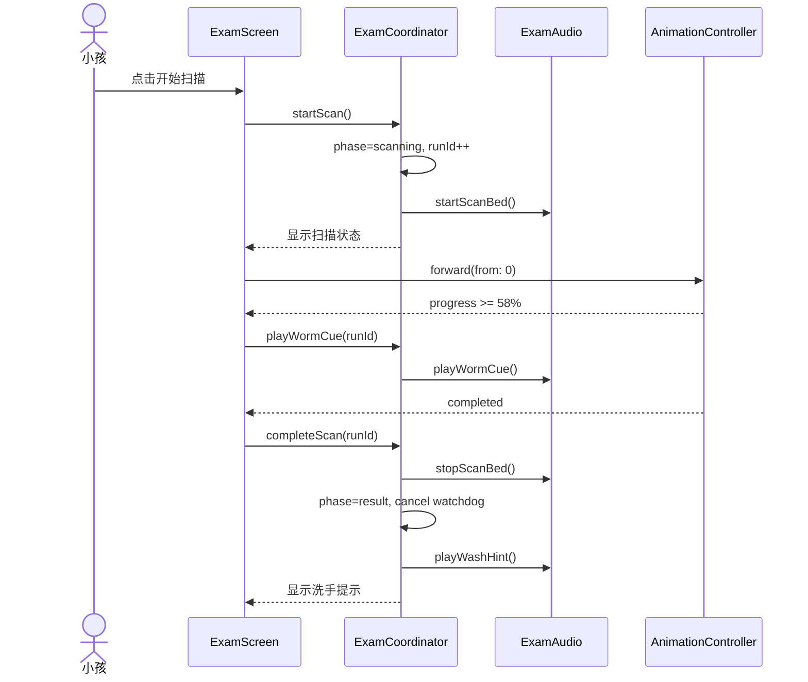

# 肚子扫描仪 产品及技术设计文档

> 版本：V1.0-dev<br>
> 状态：开发基线；功能开发可开始，素材和发布标识仍需补齐<br>
> 日期：2026-08-24<br>
> 适用范围：首版可侧载的 Flutter Android APK<br>
> 图表校验：Mermaid 已做静态语法检查；仓库暂无渲染工具，尚未完成渲染验证

这份文档定义首版的产品行为、素材交付规格和 Flutter 实现方式。开发者应能据此初始化工程、拆分任务、编写测试并产出测试 APK；美术和发布信息未到位时，可以用占位资源开发，但不能据此签出正式版本。

术语以 [CONTEXT.md](../CONTEXT.md) 为准。平台范围见 [ADR 0001](./adr/0001-flutter-android-apk-only.md)，动画选型见 [ADR 0002](./adr/0002-lottie-for-scan.md)。若本文与 ADR 冲突，以状态为“已接受”的 ADR 为准；产品文案和交互以本文为准。

## 1. 结论和交付边界

首版是一个离线、无账号、单页面的 Android 应用。成人横着拿手机或平板，小孩点一次“开始扫描”，看完约 12 秒的卡通扫描，最后看到并听到洗手提示。结果页可以直接“再看一次”。

开发基线如下：

- Android 8.0（API 26）及以上，Flutter 只构建 Android APK。
- App 锁定横屏（`sensorLandscape`，见 ADR 0003），打开即横屏，无需手动旋转。竖屏门禁代码保留为纵深防御。
- 检查有 `ready`、`scanning`、`result` 三个业务状态；竖屏提示是显示门禁，不是第四个业务状态。
- 扫描画面由一条本地 Lottie 驱动；按钮、提示文字、方向门禁和错误提示由 Flutter 绘制。
- 本地音频可失败降级，动画不能缺失。动画加载失败时不允许开始扫描。
- App 不申请网络、相机、麦克风、相册、定位或存储权限，不保存任何用户数据。

以下内容不阻塞工程和功能开发，但会阻塞对应交付：

| 未交付项 | 阻塞什么 | 开发阶段怎么处理 |
| --- | --- | --- |
| 正式 Lottie、插画、图标和音频 | 端到端内容验收 | 使用同名占位资源，时长和尺寸遵守第 7 节 |
| 正式 `applicationId` | 可升级安装的正式包 | 工程先用临时 ID，签正式包前只允许改一次 |
| 正式签名密钥及保管方式 | 正式 APK | Debug 包继续开发；密钥不得进 Git |
| 最低性能目标机和平板 | 性能验收 | 先跑第 14 节列出的模拟尺寸和现有设备 |

## 2. 产品目标、非目标和完成标准

### 2.1 目标

- 成人打开 App 后，不经过标题页或菜单就能进入检查室。
- 小孩不需要识字也能找到主按钮，并能完整看完一次扫描。
- 扫描结束后，画面和配音表达同一句洗手提示。
- 不退出 App 就能重复播放；成人也能随时用系统返回操作离开。

### 2.2 非目标

- App 不扫描正在观看的真实小孩，也不给出医学诊断。
- 不调用相机，不模拟采集人体数据，不展示病名、器官标注或检查报告。
- 没有“洗过手”和“没洗手”的对比流程，不讲小肠、大肠等知识。
- 没有标题页、菜单、设置、账号、联网、埋点、广告或付费。
- 首版不做 iOS、应用商店分发、远程更新素材或多语言。

### 2.3 产品完成标准

满足以下条件才算完成一次检查：

1. 从检查室点击“开始扫描”。
2. 扫描自动播放，中途没有跳过入口。
3. App 进入洗手提示，文字完整可见，配音触发一次。

返回退出、切到后台、转成竖屏都属于中断，不计为完成。App 不做数据记录，因此不统计完成率；首版用第 14 节的现场验收用例判断产品是否可用。

## 3. 使用者和场景

| 角色 | 行为 |
| --- | --- |
| 成人 | 打开并持有设备，必要时提醒小孩横屏观看；可以代点按钮或随时退出。常见身份是父母或老师。 |
| 小孩 | 观看卡通检查，也可以点击“开始扫描”和“再看一次”。不要求独立完成设置或阅读说明。 |

主要场景是饭前或成人发现小孩没洗手时做一次短演示，也可以在课堂上展示。设备是成人的 Android 手机或平板。首版共用一套 16:9 舞台，不为平板另做页面。

实现需处理挖孔、圆角和系统手势区，也要扛住小孩连续点击。来电、锁屏、切后台会打断播放，设备音量也可能为零；这些情况都有明确行为，不能留给 Widget 自行恢复。

## 4. 功能范围和优先级

表中八项都是 P0，缺少任一项都不发布首版。

| 编号 | 功能 | 可观察结果 |
| --- | --- | --- |
| P0-01 | 竖屏门禁 | 可用区域高于宽时，只显示“请把设备横过来”；横屏后自动进入检查室 |
| P0-02 | 检查室 | 首屏展示卡通医院、卡通小孩和唯一主按钮“开始扫描” |
| P0-03 | 自动扫描 | 点击一次后播放约 12 秒；播放中普通点击不产生状态变化 |
| P0-04 | 扫描音频 | 扫描音效随扫描开始和结束；虫子出现时播放一次蠕动音效 |
| P0-05 | 洗手提示 | 动画结束后显示固定文案并播放一次同文配音 |
| P0-06 | 再看一次 | 从洗手提示直接开始新一轮扫描，不返回检查室等待第二次点击 |
| P0-07 | 中断处理 | 返回、后台或转成竖屏时立即停止动画和全部音频；再次进入前台横屏时回到检查室 |
| P0-08 | 离线运行 | 断网和飞行模式不影响检查，清单中没有 `INTERNET` 权限 |

## 5. 用户流程



动画超时是运行时兜底，不是正常路径。它避免动画控制器异常时一直困在扫描页；测试或正式素材触发超时都算缺陷。

## 6. 状态模型

### 6.1 业务状态和环境状态

```dart
enum ExamPhase { ready, scanning, result }

enum ResourceStatus { loading, ready, failed }
```

业务状态只描述一次检查走到了哪里。方向、前后台和资源加载结果属于环境状态：

| 状态项 | 取值 | 作用 |
| --- | --- | --- |
| `ExamPhase` | `ready` / `scanning` / `result` | 决定检查室、扫描或洗手提示 |
| `isLandscape` | `true` / `false` | `false` 时盖住业务界面，只显示转横提示 |
| `ResourceStatus` | `loading` / `ready` / `failed` | 表示必需的 Lottie 是否可用，决定开始按钮是等待、可点还是资源错误；音频失败不改变它 |
| App 生命周期 | `resumed` / `inactive` / `paused` / `hidden` | 只有 `resumed` 接受新业务事件；`paused` 或 `hidden` 执行 `abort`；`inactive` 等待下一事件 |

方向不放进 `ExamPhase`。否则一次普通旋转会和“扫描结束”争用同一个状态机，容易留下动画仍在播、界面却显示方向提示的错误。

### 6.2 状态迁移



| 事件 | 前置条件 | 原子动作 | 结果 |
| --- | --- | --- | --- |
| `startScan` | 横屏、前台、资源就绪、`ready` | 先把状态改为 `scanning`，再启动动画和扫描音效 | 重复点击因状态已改变而被忽略 |
| `replay` | 横屏、前台、资源就绪、`result` | 停止配音，重置动画，进入 `scanning` | 新扫描从第 0 帧开始 |
| `animationCompleted` | `scanning` | 停止扫描音效，取消超时器，进入 `result`，触发一次配音 | 非 `scanning` 回调被忽略 |
| `wormCue` | `scanning` 且本轮尚未播放 | 播放一次虫子音效并标记已播放 | 控制器重复回调也不会重播 |
| `abort` | 任意业务状态 | 停止全部播放器，取消计时器，清除本轮标记并切到 `ready`；承载 Lottie 的 Widget 被移除时停止并归零动画 | 回到 `ready` |
| `systemBack` | 任意业务状态 | 先执行 `abort`，再调用 `SystemNavigator.pop()` | 关闭当前 Android Activity，不承诺杀死系统进程 |

所有延迟回调都带本轮扫描的 `runId`。回调触发时若 `runId` 已变化，直接丢弃，防止“上一轮动画结束”把新一轮扫描提前切到结果页。

## 7. 页面、画面和声音规格

### 7.1 全局显示规则

- App 采用沉浸式显示，进入前台时重新设置 `SystemUiMode.immersiveSticky`。
- 根节点使用 `SafeArea`。挖孔、圆角和系统手势区内不放文字或按钮。
- 横屏内容使用居中的 16:9 舞台，背景和 Lottie 都用 `BoxFit.contain`，不裁切、不拉伸。20:9 手机左右留边，4:3 平板上下留边；留边颜色取检查室背景的深色边缘色。
- 主按钮最小可点击区域为 160 × 64 dp，文字不小于 22 sp。视觉稿可以把按钮画得更大，不能小于这个下限。
- 按钮和文字由 Flutter 绘制，不能烧进背景图或 Lottie。
- 支持横屏正向和反向。只按可用区域的宽高判断横竖，不依赖固定的物理朝向。
- 业务内容只支持简体中文。系统字体放大到 1.3 倍时，固定文案仍须完整显示；超过 1.3 倍允许在舞台内缩小布局，但不能截断主按钮。

建议用以下窗口尺寸做布局基线，单位为逻辑像素：

| 类型 | 尺寸 | 重点检查 |
| --- | --- | --- |
| 16:9 手机 | 640 × 360 | 最低高度、按钮和文案不碰安全区 |
| 20:9 手机 | 800 × 360 | 左右留边、场景不被横向拉伸 |
| 16:10 平板 | 960 × 600 | 上下留边、按钮不因放大失控 |
| 4:3 平板 | 1024 × 768 | 舞台居中、结果文案位置稳定 |

### 7.2 竖屏门禁

| 项目 | 规格 |
| --- | --- |
| 显示条件 | `MediaQuery.size.height > MediaQuery.size.width` |
| 画面 | 纯色背景、横向设备图标、文案“请把设备横过来” |
| 交互 | 无按钮；转横后自动消失；系统返回仍可离开 |
| 进入时动作 | 若正在扫描或结果配音尚未结束，执行 `abort` |
| 无障碍 | 整页语义为“请把设备横过来” |

首版按 ADR 0003 在 AndroidManifest 锁定 `sensorLandscape`，窗口一直是横屏，门禁在正常运行时不可达，保留作为纵深防御。若撤销锁定，本节行为即恢复生效。

### 7.3 检查室（`ready`）

检查室是亮色卡通医院。卡通 X 光机和卡通小孩已经在场，屏幕中央偏下只有一个主按钮“开始扫描”。不要做标题、玩法说明或设置入口。

资源仍在加载时，按钮位置显示不旋转的简短等待文字“正在准备…”，不接受点击。加载成功后替换成“开始扫描”。加载失败则显示“加载失败，请重新打开应用”，不展示一个点了也无法工作的按钮。

### 7.4 扫描（`scanning`）

扫描由全屏 Lottie 播放，时长基线为 12,000 ms，允许正式素材在 11,500～12,500 ms 内调整。播放期间：

- 不显示按钮；普通点击、双击和长按都无效。
- 扫描音效从第 0 帧开始，动画结束、被中断或超时时停止。
- 虫子音效在动画进度首次达到 58% 时播放一次。正式动画调整虫子出现时间时，必须同步修改该常量和测试。
- 超时器取 `动画实际时长 + 1,000 ms`，而不是写死 13 秒。超时后进入洗手提示并在调试日志记录原因。
- 动画控制器状态为完成时进入洗手提示。不能另设一个 12 秒计时器充当正常结束条件。

建议分镜如下。它是首版素材的制作基线，正式交付时可在总时长范围内微调：

| 时间 | 画面 | 声音 |
| --- | --- | --- |
| 0.0～1.0 s | 机器亮起，扫描线出现 | 扫描音效起 |
| 1.0～4.5 s | 扫描线扫过卡通小孩，身体保持卡通质感 | 扫描音效持续 |
| 4.5～7.0 s | 肚子逐渐半透明，露出简化肠道 | 扫描音效持续 |
| 约 7.0 s | 圆滚滚的虫子出现 | 虫子蠕动音效播放一次 |
| 7.0～11.5 s | 虫子蠕动，画面停留到足以看清 | 扫描音效持续 |
| 11.5～12.0 s | 扫描线熄灭，准备切结果 | 扫描音效淡出或直接停止 |

虫子要“有点恶心但不恐怖”：圆钝轮廓、数量可数、不出现尖牙、伤口、血液、排泄物或写实皮肤纹理。肠道不标名字，不使用真实影像。

### 7.5 洗手提示（`result`）

结果页保留 Lottie 末帧，由 Flutter 叠加浅色半透明提示板。提示板不超过 16:9 舞台宽度的 75%，位于安全区内，包含文案和按钮；这样可以保留虫子画面，又不会依赖动画背景保证文字对比度。文案不能烧进 Lottie。固定原文是：

> 不洗手就吃东西，肚子里会长虫子。快去洗手！

文案最多排两行，水平居中。进入 `result` 时 Lottie 控制器停在完成位置，配音播放一次且不循环。下方显示“再看一次”按钮。点击后先停配音，再把同一个控制器归零并从第 0 帧播放。

### 7.6 文案表

| 标识 | 原文 | 使用位置 |
| --- | --- | --- |
| `rotateHint` | 请把设备横过来 | 竖屏门禁 |
| `preparing` | 正在准备… | 检查室资源加载中 |
| `startScan` | 开始扫描 | 检查室主按钮 |
| `washHint` | 不洗手就吃东西，肚子里会长虫子。快去洗手！ | 结果文字和配音脚本 |
| `replay` | 再看一次 | 结果页主按钮 |
| `loadFailed` | 加载失败，请重新打开应用 | Lottie 加载失败 |

### 7.7 素材交付清单

| 文件路径 | 格式和规格 | 用途 | 验收 |
| --- | --- | --- | --- |
| `assets/images/exam_room.webp` | 1920 × 1080，sRGB，不含按钮和文字 | 检查室背景 | `BoxFit.contain` 下四边无关键内容被裁 |
| `assets/lottie/scan.json` | 1920 × 1080 画布，30 fps，约 360 帧，全矢量，不含文字 | 扫描全过程 | Lottie Flutter 真机可播；无缺图、遮罩错位和 AE 不支持效果 |
| `assets/audio/scan_loop.mp3` | 单声道，44.1 kHz，建议 96～128 kbps，可无缝循环 | 扫描底音 | 循环点无爆音；中断后 200 ms 内停止 |
| `assets/audio/worm_cue.mp3` | 单声道，44.1 kHz，建议 96～128 kbps，单次短音效 | 虫子出现 | 不刺耳，不盖住后续配音 |
| `assets/audio/wash_hint.mp3` | 单声道，44.1 kHz，建议 96～128 kbps | 洗手配音 | 内容逐字等于 `washHint`，前后无长静音 |
| `assets/icon/app_icon_1024.png` | 1024 × 1024，sRGB | 生成 Android launcher icon | 缩到小图标仍能识别，不含细小文字 |

首版 `scan.json` 不引用外部位图，避免漏打包和不同加载器的路径差异。如果正式动画必须使用外部位图，应先补齐交付清单、`pubspec.yaml` 和真机加载测试，再接入资源。动画制作工具的预览不算验收，以 Flutter 真机播放为准。

所有素材必须确认拥有随 APK 分发的权利。仓库记录来源、作者和许可，但这类说明不放进面向小孩的界面。

## 8. 技术架构

首版使用单路由和内存状态，不引入通用状态管理框架、依赖注入容器或数据层。音频需要本地播放器和测试替身两种实现，因此只在这里保留接口。



| 模块 | 对外接口 | 内部职责 |
| --- | --- | --- |
| `AppShell` | Flutter 根 Widget | 主题、沉浸式显示、单路由、根级 `PopScope` |
| `OrientationGate` | `child` | 用窗口宽高决定是否显示竖屏门禁；进入竖屏时通知中断 |
| `LifecycleAndBack` | 生命周期和返回事件回调 | 前后台重置、先停音频再关闭 Activity |
| `ExamCoordinator` | `resourcesReady`、`resourcesFailed`、`startScan`、`replay`、`completeScan`、`playWormCue`、`abort` | 唯一状态写入口、资源状态、重复点击保护、`runId`、超时器、音频编排 |
| `ExamScreen` | `ExamCoordinator` 的只读状态 | 渲染检查室；在 `scanning` 和 `result` 期间保留同一个 Lottie Widget；把动画回调转给协调器 |
| `ExamAudio` | `prepare`、`startScanBed`、`stopScanBed`、`playWormCue`、`playWashHint`、`stopAll` | 隐藏播放器数量、资源切换、循环和停止细节 |
| `LocalAudio` | 实现 `ExamAudio` | 使用本地资源和三个播放器，分别管理扫描底音、虫子音效和配音 |

`ExamCoordinator` 是状态和副作用的唯一入口。Widget 不直接调用音频播放器，也不在 `build` 中启动计时器。这样单元测试可以用内存音频替身检查调用次数，而不需要加载平台播放器。

`OrientationGate` 通过 `WidgetsBindingObserver.didChangeMetrics` 识别方向变化，只在横竖状态真正切换时发送一次事件。`build` 只读当前方向并渲染，不能在构建过程中调用 `abort`。

### 8.1 目录

```text
lib/
  main.dart
  app.dart
  exam/
    exam_phase.dart
    exam_coordinator.dart
    exam_screen.dart
    orientation_gate.dart
    widgets/
      ready_view.dart
      scanning_view.dart
      result_view.dart
      rotate_hint_view.dart
  audio/
    exam_audio.dart
    local_audio.dart
  resources/
    asset_paths.dart
    copy.dart
assets/
  audio/
    scan_loop.mp3
    worm_cue.mp3
    wash_hint.mp3
  images/
    exam_room.webp
  lottie/
    scan.json
  icon/
    app_icon_1024.png
test/
  exam/
  audio/
  golden/
integration_test/
  exam_flow_test.dart
```

如果最终代码不足以支撑某个子目录，可以合并文件，但不能把状态迁移、播放器调用和 Widget 副作用重新混在一个 `build` 方法里。

### 8.2 依赖

| 类型 | 依赖 | 用途 | 约束 |
| --- | --- | --- | --- |
| 运行时 | Flutter SDK | UI、生命周期、方向和 Android 壳 | 锁定稳定版 3.44.7（`.flutter-version`）并提交 `pubspec.lock` |
| 运行时 | `lottie` 3.5.1 | 播放本地 `scan.json` | 版本写死在 `pubspec.yaml`（无 `^`），升级需回归正式动画 |
| 运行时 | `audioplayers` 6.8.1 | 播放和停止本地 MP3 | 版本写死；只用本地 `AssetSource`，不传 URL |
| 开发 | `flutter_lints` 6.0.0 | 静态检查 | 版本写死；`flutter analyze` 无错误 |
| 测试 | `flutter_test`、`integration_test` | 单元、Widget、Golden 和真机流程测试 | 使用 SDK 自带包 |
| 测试 | `fake_async` 1.3.3 | 协调器单元测试的可控时钟 | 版本写死；不真实等待 12 秒 |
| 测试 | `audioplayers_platform_interface` 7.2.0 | `LocalAudio` 单元测试的假平台 | 版本写死；只进 dev_dependencies，不打包进 APK；`LocalAudio` 测试改为纯集成测试时可删除 |

不引入路由、网络、数据库、日志上传或响应式布局第三方包。版本号在初始化工程时按当日 Flutter 稳定版兼容范围选择，提交 `pubspec.lock`；“永远取最新版”不是可复现的构建方式。

## 9. Android 和 Flutter 配置

### 9.1 Android

| 配置 | 值 |
| --- | --- |
| App 显示名称 | 肚子扫描仪 |
| `minSdk` | 26 |
| `targetSdk` / `compileSdk` | 36 / 36（Flutter 3.44.7 stable 模板生成并已验证，实际数字提交在 Gradle 配置中） |
| 屏幕方向 | `android:screenOrientation="sensorLandscape"`（锁定横屏，两个方向跟随传感器；见 ADR 0003） |
| 网络 | Manifest 不声明 `android.permission.INTERNET` |
| 备份 | `android:allowBackup="false"` |
| 明文网络 | `android:usesCleartextTraffic="false"` |
| Activity 数量 | Flutter 主 Activity 一处 |

`applicationId` 在签第一个正式包前确定。临时包可以使用 `com.example.child_doctor_app`，但不得拿临时 ID 对外分发，因为更换 ID 后 Android 会把它当成另一个 App。

正式签名通过本机 `key.properties`、环境变量或 CI 密钥注入。仓库只提交示例配置，不提交 keystore、密码或含真实路径的文件。

### 9.2 Flutter 启动顺序

1. `WidgetsFlutterBinding.ensureInitialized()`。
2. 设置沉浸式 UI；不调用只允许 landscape 的 `setPreferredOrientations`。
3. 创建 `LocalAudio` 和 `ExamCoordinator`，通过构造参数传给 `AppShell`。
4. `runApp` 后异步预加载 Lottie composition，同时调用 `ExamAudio.prepare()` 准备本地音频。
5. Lottie 加载成功后调用 `resourcesReady(animationDuration)`；失败则调用 `resourcesFailed()`。只有前者允许开始扫描。音频准备失败按静默降级处理，不阻塞按钮。

预加载不能阻塞第一帧。成人应先看到检查室和“正在准备…”，素材就绪后原位显示按钮。

### 9.3 `pubspec.yaml` 资源声明

资源逐个声明，避免目录里临时文件被误打包：

```yaml
flutter:
  assets:
    - assets/images/exam_room.webp
    - assets/lottie/scan.json
    - assets/audio/scan_loop.mp3
    - assets/audio/worm_cue.mp3
    - assets/audio/wash_hint.mp3
```

App 图标在开发阶段生成到 Android `mipmap-*` 并提交，运行时不读取 `assets/icon/app_icon_1024.png`。无论使用 Android Studio 还是一次性图标生成工具，提交前都要核对各密度目录，不把生成工具加入运行时依赖。

## 10. 动画和音频编排

一次扫描的控制顺序如下：



音频错误不能阻止状态迁移。每次播放器调用都捕获错误并写本地调试日志；正式包不上传日志，也不向小孩展示播放器错误。Lottie 加载失败则不同：没有扫描内容时不允许进入 `scanning`。

使用三个底层播放器，分别负责扫描循环底音、虫子音效和配音。这样虫子音效不会打断扫描底音，配音也不复用尚未结束的音效实例。进入结果前先停止扫描底音，再播放配音；点击“再看一次”时先停配音。`stopAll` 必须可重复调用且不会抛出未处理异常。

## 11. 方向、生命周期和返回处理

| 事件 | 当前状态 | 行为 | 恢复后的状态 |
| --- | --- | --- | --- |
| 横屏转竖屏 | 任意 | 显示门禁；若不在 `ready`，执行 `abort` | 再转横后是 `ready` |
| `AppLifecycleState.paused` 或 `hidden` | 任意 | 执行 `abort` | 回前台后是 `ready` |
| `inactive` | 任意 | 不迁移状态，不接受新的 `startScan` 或 `replay`，等待后续生命周期事件 | 后续 `resumed` 继续；若再进入 `paused/hidden` 则重置 |
| `resumed` | `ready` | 重新应用沉浸式 UI | `ready` |
| 系统返回 | 任意 | `abort` 完成后 `SystemNavigator.pop()` | Activity 被关闭 |
| 音频焦点被其他 App 抢占 | `scanning` 或 `result` | 允许系统暂停/降低音频；画面照常走 | 不重播已触发的配音 |

根节点用 `PopScope(canPop: false)` 接管系统返回。在回调中等待 `abort` 完成，再调用 `SystemNavigator.pop()`；不能先关 Activity，再依赖 `dispose` 碰运气停止音频。

App 不承诺“退出进程”。Android 是否保留进程由系统决定；产品要求是当前 Activity 关闭且后台不再播放声音。

## 12. 数据、隐私和安全

App 没有业务数据模型。业务代码不读取用户文件，不写偏好设置、数据库或系统相册；播放器若把包内素材解压到 App 私有缓存，其中也不含用户数据。重开 App 一律从 `ready` 开始。`runId`、状态和播放标记只存在内存中。

发布前检查生成后的合并 Manifest，而不是只看源码 Manifest。验收要求：

- 没有网络、相机、麦克风、定位、蓝牙、通知和存储权限。
- 没有统计、广告、崩溃上传和远程配置 SDK。
- 飞行模式下流程完整。
- `adb shell dumpsys package <applicationId>` 显示的 requested permissions 与预期一致。
- APK 中只包含已登记来源的素材，不包含源工程、临时音频或设计稿。

洗手文案是教育演示，不是检查结果。画面必须始终是固定卡通小孩，不得调用摄像头制造“正在扫描你”的误解。正式对外使用前，由内容负责人确认文案适合目标年龄；这项确认不由代码测试替代。

## 13. 错误和降级

| 故障 | 用户看到什么 | 程序处理 | 是否阻塞发布 |
| --- | --- | --- | --- |
| Lottie 预加载失败 | “加载失败，请重新打开应用” | `ResourceStatus.failed`，禁用扫描入口 | 是 |
| Lottie 播放超过实际时长 1 秒仍未完成 | 自动进入洗手提示 | 停动画和扫描音效，记录 watchdog 日志 | 是；运行时只做兜底 |
| 某段音频加载或播放失败 | 画面照常进行 | 捕获错误，本轮不重试，不弹技术错误 | 正式素材持续失败时阻塞 |
| 重复点击开始或再看一次 | 无额外反馈 | 第一次调用先改状态，后续调用因前置条件不满足被忽略 | 否 |
| 上一轮延迟回调晚到 | 无变化 | `runId` 不匹配，丢弃回调 | 否 |
| 切后台或转竖屏 | 回来后看到检查室 | `abort` 停止全部副作用并归零 | 否 |
| 系统音量为零 | 无声音，文字仍完整显示 | 不强制改系统音量，不弹窗 | 否 |

首版没有网络和可恢复数据，因此没有超时重试、补偿事务或持久化恢复。资源错误靠构建和验收发现，不在运行时下载替代资源。

## 14. 测试和验收

### 14.1 自动化测试

| 层级 | 必测内容 |
| --- | --- |
| 单元测试 | 三个业务状态的合法迁移；非法和重复事件被忽略；`runId` 丢弃旧回调；虫子音效每轮一次；`abort` 可重复调用；watchdog 取消和触发 |
| Widget 测试 | 竖屏只显示转横提示；四种横屏尺寸布局；资源 loading/failed；扫描中没有按钮；结果文案逐字一致；系统字体 1.3 倍不溢出 |
| Golden 测试 | `ready`、`scanning` 代表帧、`result` 在 16:9 手机、20:9 手机和 4:3 平板上的布局 |
| 集成测试 | 横屏完整播放；重复点击；再看一次；扫描中切后台后重置；转竖屏后重置；返回后无音频；飞行模式完整运行 |
| 构建检查 | `flutter analyze`、`flutter test`、release APK 构建、合并 Manifest 权限检查、APK 体积记录 |

动画和音频由系统时钟驱动的测试要注入时钟或使用可控 fake，不能让单元测试真的等待 12 秒。集成测试可以提供测试构建开关把动画缩短，但至少有一次真机验收使用正式时长和正式资源。

### 14.2 现场验收用例

每个候选发布包在最低 Android 版本手机、常用手机和一台平板上各执行一次。最低性能目标机尚未指定前，测试结果必须记录设备型号、Android 版本、屏幕尺寸和包的 commit。

| 编号 | 操作 | 预期结果 |
| --- | --- | --- |
| A01 | 竖屏冷启动 | 第一屏是转横提示，没有检查室按钮露出 |
| A02 | 转成任一方向的横屏 | 自动显示检查室，背景不拉伸，按钮不碰挖孔和手势区 |
| A03 | 连点“开始扫描”5 次 | 只开始一轮扫描，只播一份扫描音效 |
| A04 | 扫描期间点击和长按画面 | 不跳过、不暂停、不出现按钮 |
| A05 | 正常看完 | 11.5～12.5 秒内进入洗手提示，配音只播一次，文字逐字一致 |
| A06 | 点击“再看一次” | 配音立即停止，扫描从第 0 帧开始，虫子音效本轮仍只播一次 |
| A07 | 扫描中转竖屏再转回 | 音频停止；横屏恢复后是检查室，不从中间继续 |
| A08 | 扫描中按 Home，再返回 App | 后台无声音；回来后是检查室 |
| A09 | 三个业务状态分别执行系统返回 | Activity 关闭，退出后没有残留音频 |
| A10 | 飞行模式冷启动并完整播放 | 与联网状态行为一致，没有网络错误 |
| A11 | 系统音量设为零 | 流程不受阻，洗手文字仍完整可见 |
| A12 | 连续“再看一次”20 轮 | 无崩溃、无明显内存持续增长、音频不叠加 |

### 14.3 性能基线

这些数值是验收门槛，不代表当前已经测得：

- 候选目标机上，冷启动到检查室第一帧不超过 2 秒；资源按钮可用不超过 3 秒。每台设备连续测 3 次，记录最慢一次。
- 正式 Lottie 按 30 fps 制作；扫描期间不能出现连续 3 帧以上的肉眼停顿。Flutter profile 模式中 30 fps 目标的单帧预算为 33 ms。
- 虫子画面出现到音效开始的偏差不超过 200 ms。
- release APK 体积先记录后设预算。素材未交付前不写一个无法验证的体积上限。

## 15. 构建、签名和交付

工程初始化时提交 Flutter 工具链版本文件、`pubspec.lock` 和 Gradle wrapper，保证同一 commit 能复现构建。常用检查命令：

```bash
flutter pub get
dart format --set-exit-if-changed lib test integration_test
flutter analyze
flutter test
flutter build apk --release
```

发布产物至少包含：

- 带版本号的 release APK；
- SHA-256 校验值；
- Git commit、Flutter 版本、`applicationId`、`versionName`、`versionCode`；
- 使用的签名别名说明，不含密钥和密码；
- 第 14 节现场验收记录。

版本规则采用 `major.minor.patch+build`。每次对外发包递增 `build`，否则同一 `applicationId` 的设备可能拒绝覆盖安装。升级验收要在已安装的上一候选版本上覆盖安装一次，并确认签名一致。

## 16. 开发拆分和顺序

| 顺序 | 工作项 | 输入 | 输出和完成条件 |
| --- | --- | --- | --- |
| 1 | 确认发布标识 | applicationId、签名负责人 | 正式 ID 记录到工程；签名文件不进仓库。没有输入时可继续做 Debug 功能 |
| 2 | 初始化 Flutter 工程 | ADR 0001、本节配置 | API 26、单 Activity、无网络权限；空工程能构建 Debug APK |
| 3 | 建立状态和音频接口 | 第 6、8、10 节 | `ExamCoordinator` 单元测试先通过；使用 fake 音频，不依赖正式素材 |
| 4 | 完成方向门禁和三态界面 | 占位图片和占位 Lottie | 四种基线尺寸的 Widget/Golden 测试通过 |
| 5 | 接入本地音频和生命周期 | 占位音频 | 重复点击、后台、旋转、返回和 20 轮重播无叠音 |
| 6 | 替换正式素材 | 第 7.7 节全部文件 | 真机播放无 Lottie 特性缺失，音画点位符合分镜 |
| 7 | 完成自动化和现场验收 | 候选发布包、目标设备 | 第 14 节测试通过；缺陷关闭或明确阻塞发布 |
| 8 | 签正式包并交付 | 正式 ID、签名、版本号 | APK、校验值、构建信息和验收记录齐全 |

步骤 3 和 4 可以并行；步骤 6 依赖正式素材，步骤 8 依赖正式发布标识和签名。除此之外不应等素材到齐才开始写功能。

## 17. 风险和待确认项

### 17.1 已接受的风险

| 风险 | 当前处理 | 重新评估条件 |
| --- | --- | --- |
| 画面像真实检查，造成误解 | 固定卡通角色、亮色医院、不用相机、不写“你的肚子”或病名 | 要加入真实人物、相机或检查结论 |
| 虫子太真或太可爱 | 按第 7.4 节限定造型，正式素材必须做成人现场审看 | 目标年龄改变或出现明显害怕反馈 |
| Lottie 在低端机卡顿 | 30 fps、矢量优先、真机 profile 验收 | 连续掉帧；改用视频或拆动画，触发 ADR 0002 复审 |
| 侧载升级失败 | 首个正式包前固定 applicationId 和签名，递增 build | 需要商店分发或更换签名主体 |
| 没声音时教育信息丢失 | 结果文字与配音逐字一致 | 后续改成纯语音内容 |

### 17.2 开发默认值

这些值供开发和占位素材先行使用，不代表已经做过用户研究：

| 项 | 默认值 | 修改影响 |
| --- | --- | --- |
| 扫描时长 | 12,000 ms，允许素材 11,500～12,500 ms | Lottie、watchdog、集成测试和验收用例 |
| 虫子音效点 | 动画进度 58% | 协调器常量和音画同步测试 |
| 舞台比例 | 16:9，其他比例留边 | 背景图、Lottie 和 Golden 基线 |
| 音频格式 | MP3、单声道、44.1 kHz | 素材导出和播放器回归 |
| 音频错误 | 本轮静默降级，不重试 | 错误表和验收 |
| 占位界面颜色 | 舞台外 `#16324F`；主按钮 `#FFB703`；按钮文字 `#3A2A00`；结果板 `#FFF8E7`、94% 不透明度；正文 `#203040` | 正式视觉稿确定后统一替换 design tokens 和 Golden 图 |

### 17.3 待确认

| 项 | 最晚确认时间 | 不确认的影响 |
| --- | --- | --- |
| 正式 `applicationId` | 第一个正式签名包之前 | 只能交付 Debug/内部测试包，不能保证覆盖升级 |
| 签名密钥、负责人和备份位置 | 第一个正式签名包之前 | 无法构建可持续升级的正式 APK |
| ~~Flutter 稳定版和依赖精确版本~~ | 已确认 | Flutter 3.44.7 stable；`lottie` 3.5.1、`audioplayers` 6.8.1、`flutter_lints` 6.0.0；锁文件已提交 |
| 正式素材负责人、许可和交付日期 | 进入端到端验收前 | 只能验证占位内容，不能做产品验收 |
| 最低性能目标手机和平板 | 性能验收前 | 只能记录现有设备结果，不能判断低端机是否达标 |
| 目标年龄范围 | 正式视觉和文案验收前 | 无法判断字号、虫子恐怖程度和措辞是否合适 |
| 洗手文案的内容负责人确认 | 正式对外使用前 | 技术包可测试，但不能作为最终教育内容发布 |

## 18. 完成定义

以下项目全部满足，首版才可以标记为完成：

- 第 4 节八项 P0 功能都有实现和对应测试。
- 正式素材全部按第 7.7 节交付，并在 Flutter 真机上验收。
- 自动化测试、三类设备现场验收和性能基线通过。
- 合并 Manifest 没有未声明的权限或第三方采集能力。
- 正式 `applicationId`、版本号和签名已确定，覆盖安装测试成功。
- release APK、SHA-256、构建信息和验收记录一并归档。
- 文案和素材的内容、版权确认有负责人记录。
